# 🧠 ML Network Intrusion Detection System — Knowledge Graph Index

Welcome to the central knowledge repository for the **ML-NIDS** project. This graph connects the end-to-end engineering architecture, machine learning models, statistical feature engineering, security audit refactors, and dataset behaviors.

---

## 🗺️ Knowledge Map & Topics

### 🏗️ Architecture & Infrastructure
- [[System-Architecture]] — End-to-end multi-threaded pipeline, Scapy daemon sniffer, thread-safe flow aggregation, FastAPI backend, and React SOC dashboard.
- [[Live-Packet-Flow-Pipeline]] — Symmetrical 5-tuple flow hashing, packet aggregation buffers, TCP flag tracking, and two-stage mutex flow eviction.
- [[Database-Schema]] — SQLite schema for persistent flow logging, telemetry storage, indexation, and REST API reporting.

### 📊 Dataset & Feature Engineering
- [[Dataset-CICIDS2017]] — Comprehensive analysis of the CICIDS2017 benchmark dataset, attack classes, Monday-Friday traffic distribution, and train/test splitting strategies.
- [[Feature-Engineering-Timing]] — Feature extraction mechanics across 78+ statistical flow features, including the critical **microsecond ($\mu s$)** timing scale synchronization.
- [[Shortcut-Learning-Port-Bias]] — Deep dive into synthetic port-to-attack memorization, security implications of target leakage, and justification for dropping `Destination Port`.

### 🤖 Machine Learning & Detection Models
- [[Machine-Learning-Models]] — Implementations and training strategies for Random Forest, XGBoost (with balanced sample weights), LightGBM, Decision Trees, Logistic Regression, and artifact serialization.
- [[Open-Set-Recognition]] — Maximum posterior confidence thresholding ($\theta = 0.55$) for detecting unknown zero-day attacks and novel threat distributions.
- [[Model-Evaluation-Metrics]] — Unweighted Macro Precision, Macro Recall, Macro F1 metrics vs. misleading overall Accuracy and Weighted F1 on imbalanced NIDS traffic.

---

## 🔄 End-to-End System Pipeline

```mermaid
graph LR
    A["[[Live-Packet-Flow-Pipeline|Live Frames]]"] --> B["[[Live-Packet-Flow-Pipeline|Scapy Sniffer]]"]
    B --> C["[[Live-Packet-Flow-Pipeline|Flow Manager (Mutex)]]"]
    C --> D["[[Feature-Engineering-Timing|Microsecond Extractor]]"]
    D --> E["[[Machine-Learning-Models|ML Classifier (RF / XGB / LGBM)]]"]
    E --> F["[[Open-Set-Recognition|Open-Set Gating]]"]
    F --> G["[[Database-Schema|SQLite Storage]]"]
    G --> H["[[System-Architecture|FastAPI & React Dashboard]]"]
```

---

## 📌 Quick Reference Guides
- **Schema & Conventions**: [[CLAUDE.md|Knowledge Base Schema]]
- **Operational Learnings & Pitfalls**: [[learnings.md|Session Learnings & Gotchas]]
