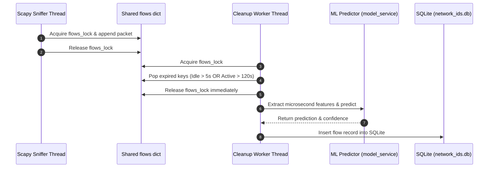

# Live Packet Capture & Flow Aggregation Pipeline

## 📌 Executive Summary
The live engine captures raw Ethernet frames using **Scapy**, parses network headers, constructs symmetrical bidirectional `Flow` objects, tracks active/idle timeouts, extracts 78 statistical telemetry parameters in microseconds ([[Feature-Engineering-Timing]]), runs model inference, and persists the results to SQLite.

---

## 🧠 Symmetrical Flow Key & Thread-Safe Flow Manager

To ensure packets traveling in both forward and backward directions belong to the same session object, `backend/live/flow_manager.py` computes an invariant 5-tuple hash:

$$\text{Flow Key} = (\min(IP_{src}, IP_{dst}), \min(Port_{src}, Port_{dst}), \max(IP_{src}, IP_{dst}), \max(Port_{src}, Port_{dst}), \text{Protocol})$$

```python
# Thread-safe packet processing in backend/live/flow_manager.py
with flows_lock:
    if flow_key not in flows:
        flows[flow_key] = Flow(
            flow_id=generate_id(),
            src_ip=packet[IP].src,
            dst_ip=packet[IP].dst,
            src_port=src_port,
            dst_port=dst_port,
            protocol=protocol,
            start_time=current_time
        )
    flow = flows[flow_key]
    flow.update(packet, current_time)
```

---

## 📐 Two-Stage Flow Eviction & Prediction Loop (`backend/live/cleanup.py`)

A background garbage collection worker runs every 1 second, applying two eviction criteria:
1. **Idle Timeout (`IDLE_TIMEOUT = 5.0` s)**: Evicts flows with no activity for 5 seconds.
2. **Active Timeout (`ACTIVE_TIMEOUT = 120.0` s)**: Forces eviction of long-running sessions (e.g. video streams, file downloads) to prevent memory leaks and provide continuous security telemetry.



---

## ⚠️ Performance Guidelines
- **Zero Heavy Compute Inside Mutex**: Never run `extract_features()`, `scaler.transform()`, or `predict()` while holding `flows_lock`. Doing so will cause Scapy's socket buffer to overflow and drop frames during high traffic.

---

## 🔗 Related Topics (Wikilinks)
- [[System-Architecture]] — Overall system topology.
- [[Feature-Engineering-Timing]] — Feature conversion rules in `extractor.py` and `statistics.py`.
- [[Database-Schema]] — Target SQLite table for expired flows.
- [[Index]] — Master Knowledge Graph Index.
