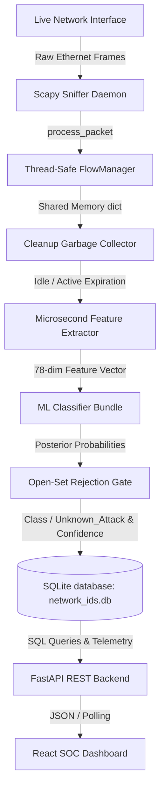

# System Architecture

## 📌 Executive Summary
The **ML-NIDS** operates as a real-time, asynchronous, multi-threaded intrusion detection and visualization pipeline. It ingests raw network frames from physical/virtual interfaces via **Scapy**, aggregates packets into bidirectional session flows, extracts statistical features aligned with [[Dataset-CICIDS2017]], runs multi-class inference with [[Machine-Learning-Models]], applies [[Open-Set-Recognition]] gating, persists logs into an [[Database-Schema|SQLite database]], and streams telemetry to a modern React SOC dashboard.

---

## 🧠 Core Concepts & Pipeline Flow

### Component Breakdown
1. **Sniffing Engine (`backend/live/capture.py`)**: Runs Scapy in a background daemon thread, listening on interface frames without blocking web server requests.
2. **Flow Tracking (`backend/live/flow_manager.py`)**: Assembles packets into symmetrical bidirectional flows protected by a global mutex (`flows_lock`). See [[Live-Packet-Flow-Pipeline]].
3. **Eviction & Extraction Worker (`backend/live/cleanup.py` & `extractor.py`)**: Scans active flows every 1 second, extracts expired sessions, calculates 78 statistical parameters in microseconds ([[Feature-Engineering-Timing]]), and runs model prediction.
4. **Persistence Layer (`backend/database.py`)**: Stores flow metadata, byte rates, classifications, and confidence values into SQLite ([[Database-Schema]]).
5. **REST API (`backend/routers/`)**: FastAPI endpoints for live status, statistical aggregations, CSV batch prediction uploads, and history export.
6. **Frontend SOC Dashboard (`frontend/src/`)**: Built on React + Vite + Chart.js, featuring link utilization graphs, threat proportion donuts, paginated flow logs, and anomaly warning toasts.

---

## ⚠️ Concurrency & Performance Guardrails
- **Mutex Lock Minimization**: The cleanup thread must only hold `flows_lock` during the key-eviction phase (identifying and removing expired flow keys from memory). Feature extraction, model scaling, inference, and database writes must occur **outside the lock** to prevent packet dropping in Scapy.
- **Microsecond Synchronization**: All timing features calculated during extraction must be scaled by $10^6$ ($\mu s$) as defined in [[Feature-Engineering-Timing]].

---

## 🔗 Related Topics (Wikilinks)
- [[Live-Packet-Flow-Pipeline]] — Flow key symmetrical hashing and buffer aggregation.
- [[Feature-Engineering-Timing]] — Feature scaling and microsecond alignment.
- [[Machine-Learning-Models]] — Offline trained models and real-time inference.
- [[Open-Set-Recognition]] — Confidence gating for zero-day threats.
- [[Database-Schema]] — SQLite table definitions and query patterns.
- [[Index]] — Master Knowledge Graph Index.
