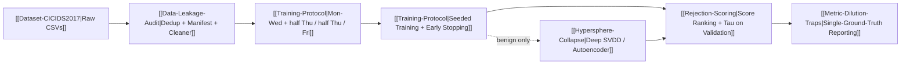

# 🧠 ML Network Intrusion Detection System — Knowledge Graph Index

Welcome to the central knowledge repository for the **ML-NIDS** project. This graph connects the end-to-end engineering architecture, machine learning models, statistical feature engineering, security audit refactors, and dataset behaviors.

> **Reading order for someone new:** [[System-Architecture]] → [[Dataset-CICIDS2017]] → [[Data-Leakage-Audit]] → [[Training-Protocol]] → [[Rejection-Scoring]]. The last three carry the results that invalidate parts of the earlier pages.

---

## 🗺️ Knowledge Map & Topics

### 🏗️ Architecture & Infrastructure
- [[System-Architecture]] — End-to-end multi-threaded pipeline, Scapy daemon sniffer, thread-safe flow aggregation, FastAPI backend, and React SOC dashboard.
- [[Live-Packet-Flow-Pipeline]] — Symmetrical 5-tuple flow hashing, packet aggregation buffers, TCP flag tracking, and two-stage mutex flow eviction.
- [[Database-Schema]] — SQLite schema for persistent flow logging, telemetry storage, indexation, and REST API reporting.

### 📊 Dataset & Feature Engineering
- [[Dataset-CICIDS2017]] — The benchmark dataset, attack classes, and per-day traffic distribution. ⚠️ *stale in parts — see the correction banner.*
- [[Data-Leakage-Audit]] — Six leakage checks, four failures. Why the same pipeline scores 99.88% under one split and 0.00085 attack recall under another. **Start here before quoting any number.**
- [[Feature-Engineering-Timing]] — Feature extraction mechanics across the statistical flow features, including the critical **microsecond ($\mu s$)** timing scale synchronization.
- [[Shortcut-Learning-Port-Bias]] — Port-to-attack memorization, target leakage, and the justification for dropping `Destination Port`.

### 🤖 Machine Learning & Detection Models
- [[Machine-Learning-Models]] — Estimator implementations, training strategies, and artifact bundling. ⚠️ *stale in parts — hyperparameters and artifact format changed.*
- [[Training-Protocol]] — The temporal split, seeding, early stopping, checkpoint selection, and mixed precision. The protocol every result must state.
- [[Hypersphere-Collapse]] — How Deep SVDD collapses to a constant function, how to read it out of a checkpoint, and the three guards that prevent it.

### 🛡️ Open-Set & Evaluation
- [[Rejection-Scoring]] — Novelty scores compared under near- and far-OOD, threshold calibration, and why AUROC came out **below** 0.5. Supersedes the method in [[Open-Set-Recognition]].
- [[Open-Set-Recognition]] — The original confidence-thresholding approach. ⚠️ *superseded — retained for the refuted mechanism and the SOC rationale.*
- [[Metric-Dilution-Traps]] — Three failures that were arithmetic rather than model collapse, including the one that inverted checkpoint selection.
- [[Model-Evaluation-Metrics]] — Macro vs. weighted metrics on imbalanced traffic. ⚠️ *stale in parts — API changed and one metric here is unsafe.*

---

## 🔄 End-to-End System Pipeline

```mermaid
graph LR
    A["[[Live-Packet-Flow-Pipeline|Live Frames]]"] --> B["[[Live-Packet-Flow-Pipeline|Scapy Sniffer]]"]
    B --> C["[[Live-Packet-Flow-Pipeline|Flow Manager (Mutex)]]"]
    C --> D["[[Feature-Engineering-Timing|Microsecond Extractor]]"]
    D --> E["[[Machine-Learning-Models|Classifier (RF / XGB / MLP / CNN / LSTM)]]"]
    E --> F["[[Rejection-Scoring|Novelty Score + Calibrated Tau]]"]
    F --> G["[[Database-Schema|SQLite Storage]]"]
    G --> H["[[System-Architecture|FastAPI & React Dashboard]]"]
```

## 🔬 Offline Experiment Pipeline

---

## 🚦 Page Status

| Page | Status | Note |
| :--- | :--- | :--- |
| [[Data-Leakage-Audit]] | current | |
| [[Training-Protocol]] | current | |
| [[Rejection-Scoring]] | current | |
| [[Hypersphere-Collapse]] | current | |
| [[Metric-Dilution-Traps]] | current | |
| [[Shortcut-Learning-Port-Bias]] | current | The one original page the refactor did not invalidate |
| [[System-Architecture]] | current | Live path unchanged; feature count now 62 |
| [[Live-Packet-Flow-Pipeline]] | current | |
| [[Database-Schema]] | current | |
| [[Dataset-CICIDS2017]] | stale | Split ratio, feature count, leakage severity |
| [[Machine-Learning-Models]] | stale | Hyperparameters, artifact format |
| [[Model-Evaluation-Metrics]] | stale | API removed; Unknown Detection Rate unsafe |
| [[Open-Set-Recognition]] | superseded | → [[Rejection-Scoring]] |

Staleness is tracked via the `code_refs` frontmatter field — see the schema in `CLAUDE.md`.

---

## 📌 Quick Reference Guides
- **Schema & Conventions**: [[CLAUDE.md|Knowledge Base Schema]]
- **Operational Learnings & Pitfalls**: [[learnings.md|Session Learnings & Gotchas]]
- **Pipeline usage**: `PIPELINE.md`
- **Check what needs ingesting**: `python scripts/process_raw_hook.py --report`
