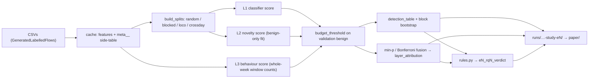

# Three-Layer Study (the experiments behind the paper)

> **STATUS (2026-10-04): the code is written and tested; no experiment has been
> run on the real dataset.** Every table this page describes is empty until
> `python src/study.py all` has run on the `GeneratedLabelledFlows` CSVs. The
> only real numbers in the project are still those of
> `runs/f853071-20260912-034653-xgb-crossday`. Do not quote a result from this
> page; quote it from `paper/SOURCES.md` once that file exists.
>
> This page has no `raw/` source: it was written together with the code. The
> plan it implements is `paper/PROTOCOL.md`, written after the one baseline run
> and before any of the six experiments. The reason behind each design choice
> on this page is in the Decision Log at the end of `CLAUDE.md` (rows `D-01`
> onwards, dated 2026-10-04).
>
> **⚠️ CORRECTION (2026-10-04, same day)** — an independent review of the first
> version of this page and of the paper draft found seven statements that were
> wrong and several that overstated. The ones that concerned this page:
> the `random` protocol de-duplicated its whole pool, so its test set was unique
> vectors while the other protocols tested raw flows (now training-only, like
> the others); "seeds 42-44 for every model whose fit is random" was true of E1
> only (E3 and E5 now refit everything per seed; E2 and E6 are single-seed and
> say so); "a monotone recalibration cannot fix threshold drift" was applied to
> a remedy that is not a monotone map of the score (now tested in E6); the
> benign-collision share was called a ceiling on detection, which it is not;
> leave-one-day-out scored de-duplicated rows and let one fold early-stop on its
> own day. The text below is the corrected version.
>
> **⚠️ CORRECTION (2026-10-04, later the same day)** — a second independent
> review, this time of the Decision Log, checked each row against the code and
> found statements on this page that the code did not back:
> "every detector goes through the same function" (Bonferroni fusion and E4's
> deployed coverage do not); "`run.py` uses `np.quantile`" (it is
> `evaluation.detection_by_class` and `openset.threshold_at_fpr`); "every table
> carries `n_blocks`" (`e2_seen_unseen` did not) and "the decision rules ignore
> intervals on fewer than 20 blocks" (no code applied that rule); "`report`
> ignores quick runs" (`all --quick` copied them into `paper/tables`, and
> `report` never removed a table an earlier run had left there); "`doctor`
> prints the parsed time range" (it only wrote it to `doctor.json`). Each was
> fixed in the code, not in the wording: see **Verdicts are computed** and the
> Gotchas below. Two things were added because of it: the yes/no rules of the
> protocol now run as code (`src/rules.py`), and E5 repeats its comparison
> under the second score rule.
>
> **⚠️ CORRECTION (2026-10-05)** — a third review, of the fixes above, found
> three statements on this page wider than the code, and the first `doctor` run
> on real files found a fourth:
> "`report` first removes the files its previous run wrote, then copies" (it
> also removed the tables of an experiment whose run folder had been deleted,
> which left `paper/` with nothing for it; and anything else sitting in the two
> folders went unmentioned); "`report` picks the newest run" (so a later look
> with `--seeds 1` replaced the planned run's tables just by being newer);
> "`SOURCES.md` lists every argument that differs from the defaults" (it also
> listed arguments the experiment never reads, and showed a run with no
> recorded command line as "none"); "RQ5 is not evaluated unless the system has
> its three layers" (the summary said so, but `fusion_helps` in the verdict
> table could still be true for a two-layer system). And `doctor` printed
> `time=NO` for a capture that **has** a timestamp column it could not read,
> which reads as "the column is missing". Each was fixed in the code; the
> Gotchas below describe what the code does now. `all` now also stops when
> `doctor` lists a problem.
>
> **What the first real `doctor` run showed (2026-10-04, run
> `96e8769-20261004-231545-study-doctor` on the laptop).** `data/` did not hold
> one download. Seven captures were `MachineLearningCSV` files (79 columns, no
> source address, no timestamp). The eighth, the Friday DDoS capture, had 85
> columns, but its timestamps read `07-07-2017 03:30`: dashes and leading
> zeros, none of the three shapes `meta.parse_cic_timestamps` reads, and 0.0%
> parsed. Its file date was 4 July 2026; the other seven carry 7 June 2018. The
> repo's own notebook read the same file name twice: first 225,745 rows with
> timestamps `7/7/2017 3:30` and a minimum `Flow Duration` of −1, later 225,743
> rows and no negative duration. `doctor` counted 225,743. Ayush confirmed on
> 2026-10-05 that he had cleaned the file by hand; that it was saved from a
> spreadsheet program is an inference from the date format. The parser was
> **not** taught the dashed shape: an edited file may differ from the original
> in other columns too. The table of what is on record is in
> [[Dataset-CICIDS2017]]; what to download is in `data/Readme.md`.

## 📌 Executive Summary
`src/study.py` measures one thing the earlier pipeline could not: **which layer
of a three-layer detector catches which attack class, at one shared false-alarm
budget, on a day the system has not seen.** The layers are the per-flow
classifier (XGBoost), a benign-only novelty model (autoencoder, with Deep SVDD,
Isolation Forest, PCA and Mahalanobis as baselines) and the label-free
per-source window counter that already runs live (`ScanTracker`). Six
experiments (E1–E6) answer six research questions; each writes its own run
directory and `report` collects them into `paper/`.

It is an *evaluation* study. Stacking these three kinds of detector is not new
and is not claimed as new.

---

## 🧠 Core Concepts & Mechanics

### One currency for every detector
A detector is a function from a flow to a score. A false-alarm budget `b`
becomes a threshold on the **validation benign** scores; a flow fires if its
score is strictly above it; the table reports, per attack class, the share of
**test** flows that fire, and beside it the false-alarm rate that threshold
actually produced on test benign flows. Classifier, novelty model, window
counter and every min-p fusion are single scores and go through the same
function (`stats.detection_table`), so their numbers can be put side by side.
Two tables are built differently and say so: Bonferroni fusion has one
threshold per layer, so it is tabulated from `fusion.bonferroni_fired` with
`stats.bootstrap_rates`; and E4's "deployed coverage" uses the tracker's fixed
alert level (score ≥ 1), not a budget.

### The threshold is an order statistic, not `np.quantile`
`stats.budget_threshold(ref, b)` returns the lowest observed benign score that
leaves at most `floor(n*b)` reference flows above it. `np.quantile`
interpolates and can let one flow more through; with the budget split across
layers that breaks the guarantee the fusion rule states. Checked by test: 40,000
benign flows, 0.1% budget, three layers → `np.quantile` fires 42, the budget
allows 40, `budget_threshold` fires 39.

The product pipeline still uses `np.quantile`: `evaluation.detection_by_class`
(the table `run.py train` writes, and so the baseline run) and
`openset.threshold_at_fpr`. The interpolated threshold is a slightly different
number, usually a little lower. On the validation benign flows it lets through
at most one flow more than the budget; on any other flows the two rules differ
by whatever scores fall between the two thresholds, and where scores tie they
can differ by a whole group of tied flows. It is recorded here so that a study table and a `run.py` table are
not expected to match.

### Five split protocols (see [[Training-Protocol]])
| protocol | what it isolates |
| :--- | :--- |
| `random` | the leak: all five days pooled and split at random (flows of one burst, and exact copies, on both sides) |
| `blocked` | no class's test flows precede its training flows, and every class is seen: per (capture, class), earliest 60% / next 20% / last 20% |
| `loco` | `blocked` with one attack class removed from train and validation |
| `crossday` | a new day and unseen classes (the primary protocol) |
| `closedset` | unchanged; architecture comparison only |

`crossday` also takes `val_mode="tail"`: Thursday is split in time (earlier
flows train, later flows validate) instead of at random.

In all four study protocols only the **training** split is de-duplicated;
validation and test are raw flows, so a per-class rate means the same thing
under each. (`closedset` de-duplicates its pool and is not part of the study.)
`build_splits(..., dedup_train=False)` returns the training days as recorded,
for the leave-one-day-out calibration.

### What is refitted per seed
E1, E3 and E5 refit every model with seeds 42, 43, 44 (in E3 and E5 the split
stays that of seed 42). PCA and Mahalanobis look deterministic but are fitted on
a random subsample of the benign rows, so they are refitted too. **E2 and E6
use seed 42 only**: each already needs a dozen or more fits. Their tables carry
no spread over seeds, and the paper must not imply one.

### Identifiers ride beside the features, never inside them
`meta.py` copies source/destination address, ports, protocol, timestamp, file
row and capture index into `meta__*` columns before the identifiers are dropped
from the features. `feature_columns()` is the single gate that keeps them out
of `X`; `SplitBundle.validate()` asserts it. The behaviour layer, timestamp
ordering and the block bootstrap read the side-table. This keeps the
[[Shortcut-Learning-Port-Bias]] invariant: the destination port is used only as
an aggregate (distinct ports per source per window).

### The three hypotheses about the PortScan miss
The existing run detects 0.23% of Friday's PortScan flows. Three explanations,
each with a different prediction, are tested rather than assumed
(`paper/PROTOCOL.md` §5):

- **H-a** no per-flow signature → low detection even when the class is seen.
- **H-b** unseen class → high when seen (`blocked`), low when held out (`loco`).
- **H-c** scan traffic labelled BENIGN on a training day taught the model that
  scans are benign → collisions with BENIGN concentrated on one day, BENIGN-only
  sources flagged by the behaviour layer, detection rises when they are removed.

### Fusion without labels
Two rules, both calibrated on validation benign flows only (`fusion.py`):
**Bonferroni** (each of `k` layers at `b/k`, OR) and **min-p** (each score →
empirical p-value against validation benign; fused score = smallest p-value;
one threshold at `b`). `layer_attribution` then splits each class's flows by
which layers fired. No stacked classifier: it would be trained on the attack
classes in validation, the opposite of a study of unseen attacks.

### Intervals resample minutes, not flows
`stats.bootstrap_rates` is a block bootstrap over (capture, minute). 158,930
PortScan flows are not 158,930 independent observations.
Verified on a constructed case: 20,000 flows in 20 blocks, half the blocks
detected → flow-level interval under 2 points wide, block-level over 30.

Every detection table and every paired table carries `n_blocks`, the number
of blocks a class's flows fall in, and a true/false column `interval_counts`
(`n_blocks ≥ 20`, `stats.MIN_BLOCKS_FOR_INTERVAL`). (In `e2_seen_unseen` the
two are suffixed `_seen` / `_unseen`; the false-alarm interval has its own
`n_blocks_benign`; the verdict tables fold the rule into their pass columns.) A class inside one block
has nothing to resample and gets a **zero-width** interval — absence of
information, not certainty. Paired tables also carry `differs`: the interval
excludes zero **and** counts (`stats.difference_supported`). The reading rule
is applied by the code, not left to the reader.

### "A beats B" is a paired statement
Two detectors scored on the same bursty test day have wide intervals that
overlap even when one is consistently better, because most of the spread is
the traffic and it moves both together. `stats.paired_difference` resamples the
same minutes for both and takes the difference inside each replicate. Tables
`e3_deep_vs_classical` (deep novelty model minus each classical one) and
`e5_gain` (full system minus each smaller one under min-p fusion, including
the difference in false alarms) and `e6_calibration_effect` (recalibrated minus
uncalibrated) are built from it. Constructed check: detector A = detector B
plus 2 points in every block, B swinging from 10% to 90% between blocks → the
two separate intervals overlap by tens of points; the paired interval is under
1 point wide and excludes zero.

### Verdicts are computed (`src/rules.py`)
Three research questions have a yes/no rule in `paper/PROTOCOL.md` (RQ3, RQ5,
RQ6). Each experiment applies its rule itself and writes the verdict as a
table, one row per case and one column per condition, so a "no" shows which
condition failed: `e3_rq3_verdict`, `e5_rq5_verdict`, `e6_rq6_verdict`
(`tests/test_rules.py` pins the rules on hand-built tables).

"A detects more than B" has two conditions everywhere:

1. the paired interval of the detection difference lies above zero, on a class
   that spans at least 20 blocks;
2. A's false alarms on the test day are **acceptable**: A is at or under the
   budget there (`within_budget`), **or** A is not shown to raise more than B:
   the paired BENIGN interval does not lie above zero (`excess_not_shown`).

Why (2) has two ways to pass: "not more than B" alone punishes A for using a
budget that B leaves unused (the behaviour layer's score is a count, ties
heavily and can fire far below its budget); "within the budget" alone can
never be met on a day when every threshold drifts over its budget, which the
baseline run showed. A gain that needs more false alarms than the budget
**and** clearly more than its comparator is refused.

What (2) does not do: it is asymmetric. Detection must be *shown* to be
higher; false alarms only *not shown* to be higher. A large but noisy excess
passes it. So `e3_rq3_verdict` and `e5_rq5_verdict` both carry the strict
reading too, `passes_strict`: A's observed false-alarm rate is not above B's
at all (`no_excess`), whatever the budget.

An incomplete table never passes. RQ3 is "not evaluated" unless all three
classical baselines the plan names were run; RQ5 is "not evaluated" unless the
system has its three layers; a comparison with a missing row is a failed row.

RQ6's claim is "recalibration **repairs** the threshold", and a repair needs
something broken: the uncalibrated threshold was over the budget on the test
day, the recalibrated one's false-alarm rate is lower (paired interval below
zero), and the lower rate is within the budget (`repairs`). Lower but still
over is `improves`. Lower when nothing was over budget is neither: that is a
stricter threshold under another name.

### The score rule is checked, not trusted
E5 computes everything that involves the classifier a second time, with the
same fitted classifier read through `1 - P(benign)`: both fusion rules, the
gains and the layer attribution (`e5_fusion_other_score_rule`,
`e5_gain_other_score_rule`, `e5_attribution_other_score_rule`), and
`e5_rq5_verdict` holds the verdict under both rules. Nothing is refitted;
subsets without the classifier are identical in both. `e5_summary` and the
figure are the primary rule's. If the two verdicts differ, the run log says so
and the paper must report RQ5 as not robust to the score rule.

### Precision at a realistic prevalence is a projection
The test day is roughly two-fifths attack traffic. `stats.projected_precision`
re-weights the measured detection and false-alarm rates to 0.1% and 1%
prevalence (`e5_summary`, any-attack rows). It assumes both rates carry over;
the paper must call it a projection.

---

## 📐 Architecture, Equations & Code Patterns



```
python src/study.py doctor     what the CSVs actually contain
python src/study.py e1         RQ1  protocol effect (random / blocked / crossday)
python src/study.py e2         RQ2  seen versus unseen, per attack class
python src/study.py e3         RQ3  benign-only novelty detectors
python src/study.py e4         RQ4  the behaviour layer
python src/study.py e5         RQ5  fusion under one budget + attribution
python src/study.py e6         RQ6  threshold transfer
python src/study.py all        each experiment in its own process, then report
python src/study.py report     newest full runs → paper/tables, paper/figures, paper/SOURCES.md
```

Behaviour score of a flow: `max(ports / 100, hosts / 50)` over its
(source, minute) group, after the direction repair
(`behaviour.canonical_endpoints`: swap endpoints when source port < 1024 ≤
destination port). `≥ 1.0` is what the live tracker alerts on.

Empirical p-value of score `s` against validation benign scores `r_1..r_n`:
`(#{r_i ≥ s} + 1) / (n + 1)`.

---

## ⚠️ Gotchas & Security Pitfalls

- **The `MachineLearningCSV` download cannot run E4 or the behaviour layer.**
  It has no source address and no timestamp. `doctor` says which distribution is
  on disk and flags a mixture of the two. See [[Dataset-CICIDS2017]].
- **A timestamp column is not a timestamp until it parses.** `doctor` prints
  `time=UNREADABLE` when the column is there and under 99% of it can be read,
  shows a value it could not read, and counts the capture as having no usable
  identifiers. 99% is the floor the cache, the time-ordered splits and the
  bootstrap blocks use too (`config.IDENTIFIER_COVERAGE`; a round number, a
  judgement call). `07-07-2017 03:30` is the shape seen on a re-saved file;
  the fix is the original file, not a wider parser.
- **`all` stops when `doctor` lists a problem.** Before the first experiment,
  with exit code 2: hours of runs on files with a known fault cannot be used,
  and their tables would sit in `paper/` looking like results.
  `--despite-problems` overrides it. Either way `SOURCES.md` repeats what the
  newest `doctor` run said about the CSVs. A dataset with identifiers in *no*
  capture is not a "problem": `all` runs, skips E4, and says so.
- **The cache outlives the CSVs.** Replacing the files in `data/` used to leave
  the old cache in place, still saying "no identifiers". The cache now records
  each CSV's size and a layout version, and rebuilds when a size changes or
  when it was written by older code (`preprocessing.sources_changed`).
- **Look before deleting.** A rebuild throws the old cache away first. It now
  checks that all eight CSVs are in `data/` before it deletes anything; if one
  is missing it stops with the list and leaves the cache in place (unused
  until the CSVs are back).
- **Timestamps are a 12-hour clock with no AM/PM**, expected to be to the minute
  on most days (`doctor` records the resolution actually found).
  `meta.parse_cic_timestamps` reads an hour below 8 as afternoon and picks
  day-first or month-first from the capture's known date. `doctor` prints, per
  capture, the hours the timestamps parse onto and the share that parse, and
  lists as a problem any capture that does not land on its own date or parses
  outside 08:00–18:00 (the capture is documented as 09:00–17:00; the extra
  hour each side is a judgement call). That catches a file with hours 6 or 7.
  It cannot catch evening traffic printed as 8–11 o'clock, which reads as
  morning.
- **A closed 60-second window on minute stamps holds two minutes.** The live
  tracker keeps observations with `ts >= now - window`. Replaying a
  minute-stamped capture through it doubles the window. `replay_scan_tracker`
  hands it a window one millisecond shorter (half-open interval).
- **Count windows over the whole week, then look up per split.** Counting
  inside a random half of Thursday sees about half of each source's flows, so
  a scan's port count roughly halves and the validation threshold is set too
  low (`behaviour.WeekBehaviour`).
- **Server-as-source flows look like scans.** CICFlowMeter names as source
  whichever side sent the first packet it saw; a web server answering 150
  clients is then "one source, 150 destination ports". The repair is measured,
  not assumed: E4's deployed-coverage tables report both. The replay, the
  budget-fitted tables and E5 use the repaired endpoints only.
- **100 ports / 50 hosts is the deployed alert level, not the study's
  threshold everywhere.** The three numbers are copied into `config.py`
  (`BEHAVIOUR_*`); a test pins the copy to the tracker's defaults. In a
  budget-fitted table the behaviour score is thresholded on validation like
  any layer, and 100 and 50 only set the scale between ports and hosts.
- **What recalibration can and cannot change.** Three cases, each pinned by a
  test in `tests/test_stats_fusion.py`:
  a *strictly* increasing map of the scalar score fires on exactly the same
  flows (the threshold is an order statistic, so it moves with the scores);
  an increasing map with flat steps, which isotonic regression produces, can
  only stop flows firing — false alarms and detections together — and never
  start one; *per-class* recalibration followed by renormalisation, which is
  what `CalibratedClassifierCV` does to a multi-class model, is **not** a
  monotone map of the largest attack probability and can reorder flows. The
  README's advice was the third kind and had never been run. E6 now runs it
  (`e6_calibration_effect`): same fitted model, same reference flows, with and
  without. The recalibration is fitted on one half of the validation flows and
  the threshold on the other, so neither sees the other's data.
- **Leave-one-day-out is not "the same model on another sample".** Each fold is
  a different model: a day less of data and, for some folds, fewer attack
  classes. It is fitted on de-duplicated flows, early-stops on a tenth of its
  own training rows (never on Thursday's validation split), and scores the
  held-out day as recorded. The time-ordered Thursday split (B) is a separate
  fit too. Only A, A2, E and D share one fitted model.
- **The primary score rule was chosen with Friday in view.** `run.py` adopted
  max P(attack class) because it detected more DDoS on the test day than
  `1 - P(benign)`. E1, E2 and E6 therefore report both rules, and E5 repeats
  its fusion comparison under the second one. E3's supervised reference row
  uses the primary rule only; no decision rule reads that row.
- **The offline replay is not the live configuration.** Same `ScanTracker`
  class, but with a half-open window, direction-repaired endpoints and no
  source eviction. The live system sees real first packets, so it has no
  direction artefact to repair.
- **`benign_collision_share` is not a ceiling on detection.** A thousand attack
  flows that share a vector with one benign flow all "collide", and catching
  them costs one false alarm. Read it with `benign_cost_share`, the share of
  benign flows that carry the class's vectors.
- **Macro-F1 over known classes is a one-class number on the cross-day test
  split** (the only known class present is BENIGN). `e1_summary` reports
  `known_classes_in_test` beside it and an attack-versus-benign F1 that is
  comparable across protocols.
- **`report` orders runs by the time stamp in the folder name**, not by name:
  names start with the commit hash. It works experiment by experiment. Where
  it has a run, it removes the files its previous report wrote for that
  experiment (the list is `.report_files.json`) and copies the new ones. Where
  it has no run folder, it touches nothing and lists the files as kept: the
  folder may have been deleted to free disk space, and the tables in `paper/`
  are then the only copy. A file it did not write is never deleted, whatever
  it is called; such files are named at the end of `SOURCES.md` as not
  covered. `SOURCES.md` lists every file the report vouches for with its run.
- **A run with other settings is still a full run to `report`.** Only `--quick`
  marks a run as "not a result". So for each experiment `report` takes the
  newest run **that follows the plan** (`study.runs_for_report`) and names a
  newer off-plan run as passed over. If no run follows the plan it takes the
  newest, calls it "not run as planned" and lists what differs; `PROTOCOL.md`
  then needs a Deviations line. What counts is the settings the experiment
  reads, resolved to the values the code uses (`study.plan_settings`):
  `--models` cannot change E4, `--epochs 30` equals no `--epochs`. A run with
  no recorded command line is treated as off-plan, not as "nothing changed".
- **"Scan-like benign flows removed" is an ablation, not a result.** It removes
  from train and validation the BENIGN-labelled flows the behaviour layer
  flags, and never touches the test day. That layer's own validation
  false-alarm rate is then optimistic by construction.
- **`--quick` runs are not results.** They are stamped and plain `report`
  ignores them. `all --quick` and `report --allow-quick` write to
  `paper/quick/` (own tables, figures and `SOURCES.md`) and never to
  `paper/tables` or `paper/figures`.
- **E2 and E6 are single-seed, and their tables say so**: the detection and
  comparison tables carry `seed`, and `results.json` records `seeds_used`
  (`config.json` holds the command line as given, where `seeds` is the default).
- **Numbers from `tests/synth_cic.py` are never evidence.** The synthetic
  captures reproduce the file quirks so the pipeline can be tested without the
  dataset. Their class geometry is invented.

### Claims this study exists to test (not yet tested)
- "Port scans are not detectable from a single flow, by construction" (README,
  `scan_tracker.py`). Every model behind that sentence was trained without a
  PortScan flow. E2 decides.
- "The Random Forest is calibrated and XGBoost is not" (README). The RF run
  directory holds only `config.json`. E6 re-measures both.
- "Wrapping XGBoost in isotonic calibration buys the same threshold
  reliability" (README). Never run. E6 runs it.

---

## 🔗 Related Topics (Wikilinks)
- [[Training-Protocol]] — The split protocols this study adds to.
- [[Data-Leakage-Audit]] — Why the random split is here only as a measured baseline.
- [[Rejection-Scoring]] — The earlier novelty-score comparison; E3 extends it per class and per budget.
- [[Shortcut-Learning-Port-Bias]] — Why the port is an aggregate in the behaviour layer and never a feature.
- [[Dataset-CICIDS2017]] — The two CSV distributions and what each can support.
- [[Hypersphere-Collapse]] — The Deep SVDD guards the novelty layer relies on.
- [[Index]] — Master Knowledge Graph Index.
